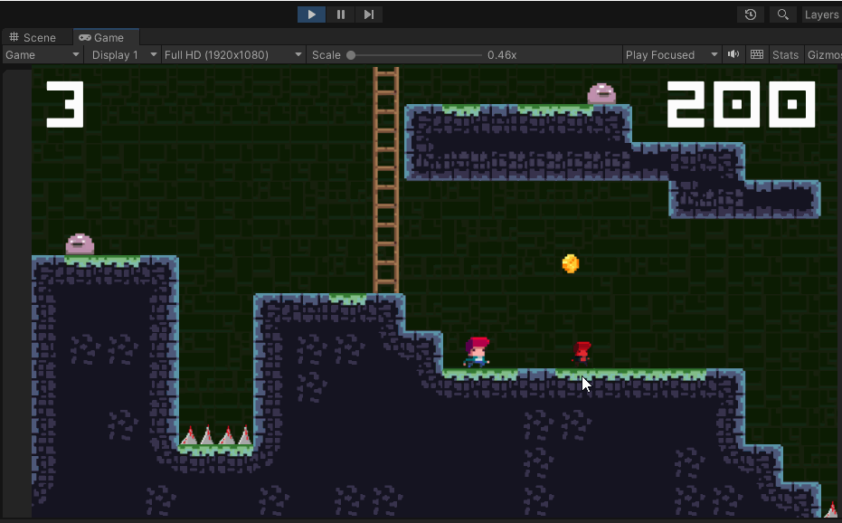
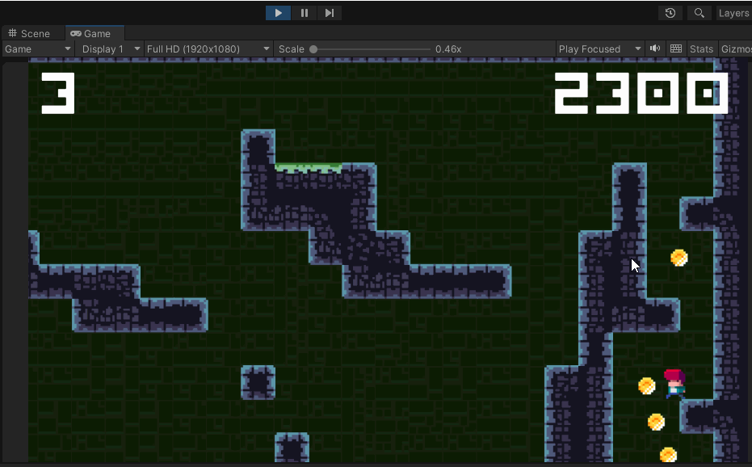

# Tile-Vania-Platformer-game_Unity

A simple platformer where I learned lots of things with Unity

<ul>
<li>Create tilemap with Rule Tiles</li>
<li>Animation controll</li>
<li>Using Prefab</li>
<li>Input System</li>
<li>State-Driven Camera</li>
<li>Singleton pattern with Game Session</li>
</ul>

<!-- Thanks to Udemy course of GameDev.tv -->
